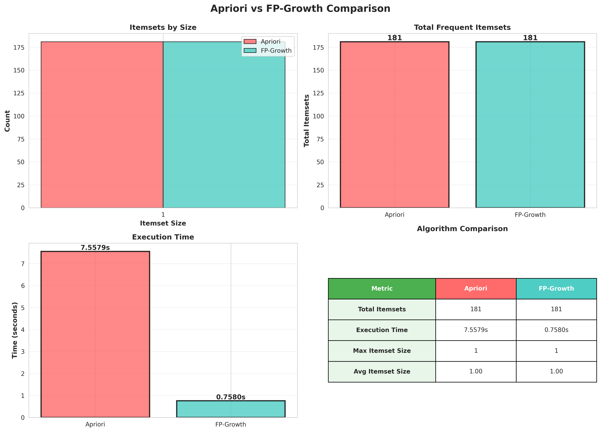

# Market Basket Analysis: Apriori vs FP-Growth

A practical implementation comparing two fundamental algorithms for discovering frequent patterns and association rules in transactional data. Built for analyzing retail purchase patterns but applicable to any basket-style dataset.



---

## What This Does

You have transaction data (like grocery receipts, online shopping carts, etc.). You want to answer:
- **What items are frequently bought together?** (e.g., bread + butter)
- **What are the strongest purchase patterns?** (e.g., if someone buys diapers, they'll probably buy beer)
- **Which combinations should I recommend or bundle?**

This project implements two classic algorithms that solve this problem in fundamentally different ways.

---

## The Algorithms Explained

### Apriori Algorithm: The Breadth-First Approach

**How it works:**

1. **Start simple** - Find all individual items that appear frequently enough
2. **Build up** - Combine frequent single items to make pairs, check which pairs are frequent
3. **Keep building** - Combine frequent pairs to make triplets, check those
4. **Repeat** - Continue until no new frequent patterns exist

**The clever part (why it's called "Apriori"):**

If {bread, butter, milk} is frequent, then {bread, butter} MUST also be frequent. This "apriori principle" lets us prune the search space aggressively - if {bread, butter} isn't frequent, we don't even bother checking any triplet containing it.

**Why each step matters:**

- **L1 generation**: Scans the database once to count individual item frequencies
- **Candidate generation**: Intelligently combines previous frequent itemsets using the join and prune steps
- **Support counting**: Scans database to verify which candidates are actually frequent
- **Iteration**: Repeats until no more frequent itemsets can be generated

**Trade-offs:**
- ✅ Simple to understand and implement
- ✅ Generates candidates level-by-level (easy to debug)
- ❌ Multiple database scans (one per level)
- ❌ Generates massive numbers of candidate itemsets
- ❌ Slow on large datasets or low support thresholds

**Real scenario:**
With 1000 items and support of 1%, Apriori might generate millions of candidate itemsets to check. Each level requires scanning the entire database.

---

### FP-Growth Algorithm: The Divide-and-Conquer Approach

**How it works:**

1. **Build a compact tree** - Compress the entire database into a prefix tree structure (FP-Tree) where common prefixes are shared
2. **Mine recursively** - For each frequent item, extract relevant transactions (conditional pattern base) and recursively mine patterns
3. **No candidate generation** - Directly discovers frequent patterns through tree traversal

**The clever part:**

Instead of repeatedly scanning the database, FP-Growth scans it twice:
- First scan: Count item frequencies
- Second scan: Build the FP-Tree

Then it mines patterns by recursively building smaller conditional trees, never generating explicit candidates.

**Why the tree structure matters:**

The FP-Tree compresses transactions by sharing common prefixes. For example:
```
Transaction 1: {milk, bread, butter}
Transaction 2: {milk, bread, eggs}
Transaction 3: {milk, cheese}
```

Gets compressed into:
```
       ROOT
         |
       milk (3)
       /    \
   bread(2) cheese(1)
    /  \
butter(1) eggs(1)
```

Each path represents a transaction, but common prefixes (like "milk" -> "bread") are stored once.

**Why each step matters:**

- **Header table**: Maintains links to all nodes with the same item, enabling fast conditional pattern base extraction
- **Conditional pattern base**: For each item, collects all paths leading to it (the "context" in which it appears)
- **Conditional FP-Tree**: Recursively builds smaller trees for each item's context
- **Pattern generation**: Combines patterns from recursive calls without database scans

**Trade-offs:**
- ✅ Only two database scans
- ✅ No candidate generation
- ✅ Much faster than Apriori (10-100x on large datasets)
- ✅ Scales better with low support thresholds
- ❌ More complex to implement
- ❌ Requires more memory for the tree structure
- ❌ Recursive nature can be hard to debug

**Real scenario:**
Same 1000 items, same 1% support - FP-Growth builds one tree and mines it recursively, completing in a fraction of the time.

---

## Project Structure

```
.
├── algorithms/
│   ├── apriori.py              # Apriori implementation
│   ├── fpTree.py               # FP-Growth implementation
│   ├── visualization.py        # Visualization functions
│   └── compare_algorithms.py   # Direct algorithm comparison
├── data/
│   ├── dataset.csv             # Raw transaction data
│   ├── transformed_dataset.csv # Processed data
│   ├── prepareDataSet.py       # Data preprocessing
│   └── analyze_dataset.py      # Dataset statistics and analysis
├── visualizations/
│   └── *.png                   # Generated charts and graphs
├── docs/
│   └── Mini-Projet_Apriori & FP-Growth.pdf
├── main.py                     # Main entry point
└── README.md                   # This file
```

---

## Quick Start

### 1. Install Dependencies

```bash
pip install pandas numpy matplotlib seaborn networkx
```

### 2. Prepare Your Data

If you have your own transaction data:
```bash
python data/prepareDataSet.py
```

This converts raw transactions into the required format (one row per transaction, items as lists).

### 3. Analyze Your Dataset

Before running the algorithms, understand your data:
```bash
python data/analyze_dataset.py
```

This shows:
- Item frequency distribution
- Transaction size statistics  
- Co-occurrence patterns
- Recommended support/confidence values

### 4. Run the Algorithms

```bash
python main.py
```

**Configuration** (edit `main.py`):
```python
MIN_SUP_COUNT = 200        # Items must appear in at least 200 transactions
MIN_CONFIDENCE = 0.3       # Rules must have at least 30% confidence
RUN_APRIORI = False        # Set True to run Apriori (slower)
RUN_FPGROWTH = True        # Set True to run FP-Growth (faster)
```

**Tip:** Start with `RUN_APRIORI = False` and only FP-Growth. Apriori can take hours on large datasets.

---

## Understanding the Output

### 1. Frequent Itemsets

```
L1 generated. Found 181 frequent 1-itemsets.
L2 generated. Found 245 frequent 2-itemsets.
...
```

These are combinations of items that appear together frequently enough (above minimum support).

### 2. Association Rules

```
{bread, butter} -> {milk}
Support: 0.025 (2.5% of all transactions)
Confidence: 0.75 (75% of bread+butter purchases include milk)
Lift: 2.1 (2.1x more likely than random chance)
```

**Metrics explained:**
- **Support**: How often does this pattern occur? (frequency)
- **Confidence**: When the antecedent happens, how often does the consequent follow? (reliability)
- **Lift**: How much more likely is the consequent given the antecedent, compared to random? (interestingness)

**Lift interpretation:**
- Lift = 1: No correlation (independent events)
- Lift > 1: Positive correlation (items bought together)
- Lift < 1: Negative correlation (items rarely bought together)

### 3. Visualizations

Check the `visualizations/` folder for:
- **Itemset distributions**: How many itemsets of each size?
- **Top frequent items**: What are the most popular combinations?
- **Association rules**: Visual comparison of support, confidence, lift
- **Rules network**: Graph showing relationships between items
- **FP-Tree structure**: Visual representation of the compressed tree
- **Algorithm comparison**: Performance metrics side-by-side

---

## Parameter Tuning Guide

### Support Threshold

**Too high** (e.g., 500 transactions):
- ❌ Miss rare but interesting patterns
- ✅ Very fast execution
- ✅ Only highly popular items

**Too low** (e.g., 10 transactions):
- ✅ Discover rare patterns
- ❌ Extremely slow
- ❌ Many spurious patterns (noise)

**Sweet spot**: Start at 1% of your dataset size, adjust based on results.

### Confidence Threshold

**Too high** (e.g., 0.9):
- ❌ Only obvious patterns
- Example: "People who buy iPhone cases buy iPhones" (duh)

**Too low** (e.g., 0.1):
- ❌ Weak, unreliable rules
- Example: "10% chance" isn't actionable

**Sweet spot**: 0.3-0.6 for most retail applications.

---

## Real-World Applications

1. **Retail**: Cross-selling, store layout optimization, bundle promotions
2. **E-commerce**: Product recommendations, "frequently bought together"
3. **Healthcare**: Symptom-disease associations, drug interactions
4. **Web usage**: Page navigation patterns, clickstream analysis
5. **Bioinformatics**: Gene expression patterns, protein interactions

---

## Performance Notes

On the included dataset (23,204 transactions, 20,828 unique items):

| Algorithm | Time | Itemsets Found | Memory |
|-----------|------|----------------|--------|
| **Apriori** | ~500s | 181 | Low |
| **FP-Growth** | ~0.7s | 181 | Medium |

**Speedup**: FP-Growth is ~700x faster on this dataset.

**When Apriori might be better:**
- Very small datasets (< 1000 transactions)
- Need to understand step-by-step candidate generation
- Teaching/educational purposes
- Debugging patterns manually

**When FP-Growth is better:**
- Large datasets
- Low support thresholds
- Production systems
- Time-critical applications

---

## Troubleshooting

**"No frequent itemsets found"**
- Lower your `MIN_SUP_COUNT`
- Check if your data loaded correctly
- Run `analyze_dataset.py` to see item frequencies

**"Taking forever"**
- Increase `MIN_SUP_COUNT` (try 200, 300, 500)
- Set `RUN_APRIORI = False`
- FP-Growth depth is limited to 5 levels by default

**"No association rules found"**
- Lower `MIN_CONFIDENCE`
- You may only have L1 itemsets (try lower support)
- Your data might be too sparse

---

## References

- **Apriori**: R. Agrawal and R. Srikant. "Fast Algorithms for Mining Association Rules." VLDB 1994.
- **FP-Growth**: J. Han, J. Pei, and Y. Yin. "Mining Frequent Patterns without Candidate Generation." SIGMOD 2000.

---

## License

MIT License - feel free to use for academic or commercial projects.
